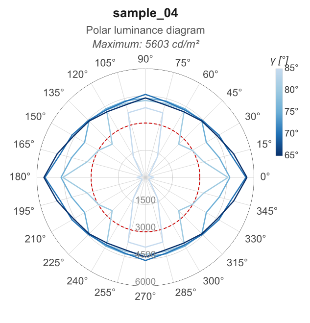

# Basic usage

This example covers the standard workflow:
loading an EULUMDAT file, computing the luminance table, inspecting the results,
exporting to CSV and JSON, and generating a polar luminance diagram.

---

## 1. Load an EULUMDAT file

`eulumdat-luminance` reads `.ldt` files through
[eulumdat-py](https://pypi.org/project/eulumdat-py/).
The installed module name is `pyldt`.

```python
from pyldt import LdtReader

ldt = LdtReader.read("data/input/sample_04.ldt")
```

`LdtReader.read()` handles all symmetry types (ISYM 0–4) and always returns a
fully expanded intensity matrix covering C 0°–360° and γ 0°–180°.

---

## 2. Compute the luminance table

```python
from eulumdat_luminance import LuminanceCalculator

result = LuminanceCalculator.compute(ldt, full=False)
```

The `full` parameter controls the angle grid used for the output:

| `full`            | Grid                                                         | Shape    | Use case                          |
| ----------------- | ------------------------------------------------------------ | -------- | --------------------------------- |
| `False` (default) | UGR grid — C: 0°–345° in 15° steps, γ: 65°–85° in 5° steps | (24, 5)  | Glare evaluation, UGR calculation |
| `True`            | Native LDT grid — all angles available in the file           | (mc, ng) | Full photometric analysis         |

When the native LDT resolution does not match the UGR grid exactly (e.g. 2.5°
step files), bilinear interpolation is applied automatically via
`scipy.interpolate.RegularGridInterpolator`.

---

## 3. Inspect the result

```python
print(result.luminaire_name)   # str — from the LDT header
print(result.maximum)          # float — maximum luminance in cd/m²
print(result.full)             # bool — True if native grid, False if UGR grid
print(result.table.shape)      # (n_c, n_g) — rows = C-planes, columns = γ angles
print(result.c_axis)           # np.ndarray — C-plane angles in degrees
print(result.g_axis)           # np.ndarray — γ angles in degrees
```

Example output for `sample_04.ldt` (linear luminaire 1480 × 63 mm, 12334 lm):

```
sample_04
5603.4
False
(24, 5)
[  0.  15.  30.  45.  60.  75.  90. 105. 120. 135. 150. 165. 180. 195.
 210. 225. 240. 255. 270. 285. 300. 315. 330. 345.]
[65. 70. 75. 80. 85.]
```

Access individual values by index:

```python
import numpy as np

# Luminance at C=0°, γ=65°
idx_c = int(np.searchsorted(result.c_axis, 0.0))
idx_g = int(np.searchsorted(result.g_axis, 65.0))
print(result.table[idx_c, idx_g])   # → 5603 cd/m²

# Luminance at C=0°, γ=85°
idx_g85 = int(np.searchsorted(result.g_axis, 85.0))
print(result.table[idx_c, idx_g85]) # → 463 cd/m²
```

---

## 4. Interpolate at arbitrary angles

`LuminanceResult.at()` returns the luminance at any (C, γ) pair by bilinear
interpolation — the angles do not need to match the stored grid exactly.
This is useful when integrating with `eulumdat-ugr`, which queries luminance
at arbitrary directions.

```python
import numpy as np

# Compute with full=True for best accuracy (native LDT resolution)
result_full = LuminanceCalculator.compute(ldt, full=True)

# Single point — returns float
lum = result_full.at(c_deg=12.0, g_deg=67.0)
print(f"L(C=12°, γ=67°) = {lum:.1f} cd/m²")

# Batch query — returns np.ndarray, same shape as inputs
lums = result_full.at(
    c_deg=np.array([0.0, 12.0, 90.0]),
    g_deg=np.array([65.0, 67.0, 75.0]),
)
print(lums)   # array of 3 values in cd/m²
```

**Notes:**
- The C axis is extended to 360° internally (copy of C=0°), so angles near
  the 345°–360° wrap-around are handled correctly.
- Querying outside the γ range of the stored table raises `ValueError`.
- Use `full=True` for maximum precision; the UGR grid (`full=False`) works
  too but has coarser resolution.

---

## 5. Projected luminous area at arbitrary angles

`LuminanceResult.projected_area()` returns the projected luminous area A_proj (m²)
seen from direction (C, γ).  It uses the same physical model as the luminance
calculation:

```
A_proj(C, γ) = A_bottom · cos(γ) + A_side(C) · sin(γ)
```

This method is the primary integration point for `eulumdat-ugr`, which needs
A_proj to compute the solid angle ω = A_proj / r².

```python
import numpy as np

result = LuminanceCalculator.compute(ldt, full=False)

# Single point — returns float (m²)
area = result.projected_area(c_deg=0.0, g_deg=65.0)
print(f"A_proj(C=0°, γ=65°) = {area:.6f} m²")

# Batch query — returns np.ndarray, same shape as inputs
areas = result.projected_area(
    c_deg=np.array([0.0, 90.0, 180.0]),
    g_deg=np.array([65.0, 75.0, 85.0]),
)
print(areas)   # array of 3 values in m²
```

Example output for `sample_04.ldt` (1480 × 63 mm flat luminaire):

```
A_proj(C=0°, γ=65°) = 0.039401 m²
# Hand check: 1.480 × 0.063 × cos(65°) = 0.039401 m²  ✓
```

**Notes:**
- Requires `full=False` or `full=True` — both work since geometry is stored
  regardless of the angle grid.
- Calling `projected_area()` on a `LuminanceResult` built directly (not via
  `LuminanceCalculator.compute()`) raises `AttributeError`.

---

## 6. Export to CSV and JSON

```python
result.to_csv("data/output/luminance.csv")
result.to_json("data/output/luminance.json")
```

### CSV format

Rows = C-plane angles, columns = γ angles. The first row is the header.

```
C \ γ (°),65.0,70.0,75.0,80.0,85.0
0.0,5603.4,3821.7,2109.8,983.2,463.1
15.0,5598.1,3817.4,2107.2,982.0,462.5
...
```

### JSON format

```json
{
  "luminaire_name": "sample_04",
  "full": false,
  "maximum_cd_m2": 5603.4,
  "c_axis_deg": [0.0, 15.0, 30.0, "..."],
  "g_axis_deg": [65.0, 70.0, 75.0, 80.0, 85.0],
  "table_cd_m2": [
    [5603.4, 3821.7, 2109.8, 983.2, 463.1],
    "..."
  ]
}
```

---

## 7. Generate the polar luminance diagram

```python
from eulumdat_luminance import LuminancePlot

plot = LuminancePlot(result)
```

### SVG output

SVG is the recommended format for embedding in reports or web pages.
It is resolution-independent and can be scaled without quality loss.

```python
plot.polar("data/output/polar.svg")
```

### PNG output

PNG is rasterised from the SVG via `vl-convert-python`.
The default style is `PolarStyle.for_print(width_cm=10, dpi=150, font_scale=2.11)`:
10 cm at 150 dpi with fonts equivalent to Arial 9pt, producing a PNG of approximately
591 × 690 px (`scale=1.0`).

```python
plot.polar("data/output/polar.png")
```

### JPG output

```python
plot.polar("data/output/polar.jpg")   # quality 92, via Pillow
```

### Selecting γ angles

By default all γ angles available in the result are drawn (65°, 70°, 75°, 80°, 85°
for a UGR grid).  Pass `g_angles` to restrict the selection:

```python
plot.polar("data/output/polar_65_85.svg", g_angles=[65.0, 85.0])
```

### Print-ready output

The default style already produces a print-ready diagram (10 cm at 150 dpi,
Arial 9pt equivalent).  Use `PolarStyle.for_print()` explicitly to choose a
different size, resolution, or font scale.

```python
from eulumdat_luminance import PolarStyle

# 8 cm at 300 dpi — standard datasheet quality
style = PolarStyle.for_print(width_cm=8, dpi=300)
plot.polar("data/output/polar_print.png", style=style)

# 12 cm at 150 dpi with larger fonts (Arial 10pt equivalent)
style = PolarStyle.for_print(width_cm=12, dpi=150, font_scale=2.11)
plot.polar("data/output/polar_large.png", style=style)
```

Example output (`sample_04`, default style — 10 cm at 150 dpi, `font_scale=2.11`):



---

## 8. Full workflow — minimal script

```python
from pathlib import Path
from pyldt import LdtReader
from eulumdat_luminance import LuminanceCalculator, LuminancePlot

ldt_file   = Path("data/input/sample_04.ldt")
output_dir = Path("data/output")
output_dir.mkdir(parents=True, exist_ok=True)

ldt    = LdtReader.read(str(ldt_file))
result = LuminanceCalculator.compute(ldt, full=False)
print(f"{result.luminaire_name} — max {result.maximum:.0f} cd/m²")

result.to_csv(output_dir / "luminance.csv")
result.to_json(output_dir / "luminance.json")

plot = LuminancePlot(result)
plot.polar(output_dir / "polar.svg")
plot.polar(output_dir / "polar.png")
```

---

## See also

- [eulumdat-py](https://pypi.org/project/eulumdat-py/) — EULUMDAT parser and writer
- [eulumdat-plot](https://pypi.org/project/eulumdat-plot/) — polar intensity diagrams
- [eulumdat-ugr](https://pypi.org/project/eulumdat-ugr/) — UGR glare calculation *(coming soon)*
- `02_resize_and_export.md` — print sizing, font scaling, custom style
